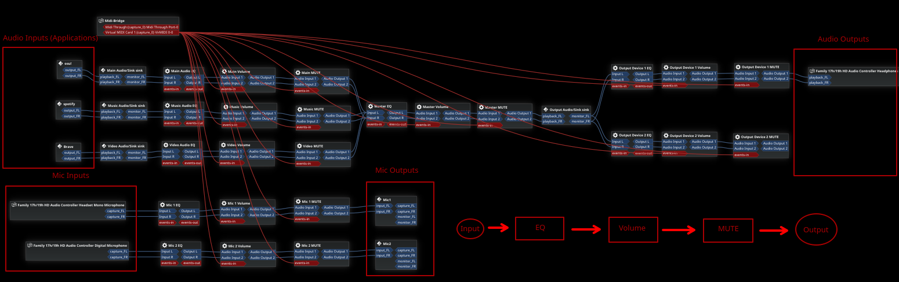

# My audio
## (it's slightly more difficult and annoying than Voicemeeter on Windows)

Audio setup on Linux using PipeWire, Carla, qpwgraph, xbindkeys, virtual sinks, virtual MIDI devices and custom bash scripts.

# Carla configuration
* `[INPUT] > EQ (LSP Parametric Equalizer x16 Stereo) > Volume (Audio Gain (Stereo)) > MUTE (Audio Gain (Stereo)) > [OUTPUT]`
* `Make MIDI range on all volume gain controls 0-1`

## Stuff
* `Carla`: used as a plugin host (looking for alternatives/custom version)
* `qpwgraph`: used as a graph and to automatically or manually route my audio sources (not needed)
* `monitor-audio.sh`: automatically unlinks audio sources from the default sink if it is also linked to anything else
* `send-macro.sh`: used to send the virtual MIDI commands, mainly by xbindkeys
* `update-midi.sh`: used to make sure MIDI is set to the correct value
* `xbindkeys`: used to setup keyboard keybinds to send MIDI commands using the `send-macro.sh` script
* `Virtual sinks`: used to make things more arranged and easier
* `Virtual MIDI`: used to control audio/plugins in Carla

## Dependencies
* `jq` Parse JSON
* `xbindkeys` Keyboard binds
* `carla` Plugin host
* `qpwgraph` PipeWire graph
* `pipewire-jack` `pipewire-pulse` `pipewire-alsa` To make everything work more smoothly
* `alsa-utils` For MIDI
* `lsp-plugins` `calf` Plugins for Carla

## Macros format
`<macro name> : <save name> : <MIDI device> : <MIDI CC> : <channel (0-15)> : <change amount> : <is toggle> : <toggle low> : <toggle high>`

## Saves format
`<save name> : <value>`

## Routes format
`<string/regex to route from> : <string/regex to route to> : <from type (1 = node name, 2 = application name, 3 = binary name, defaults to 1)> : <to type (1 = node name, 2 = application name, 3 = binary name, defaults to 1)>`

## Macros example
```
volume-up : volume : hw:0,0 : 1 : 15 : 5
volume-down : volume : hw:0,0 : 1 : 15 : -5
toggle-mute : mute : hw:0,0 : 2 : 15 : 0 : true
```
## Routes example
```
spotify : Music
Brave : Video
```

## Routing

I have all my plugins routed using Carla and all external stuff like Spotify, outputs and MIDI routed through qpwgraph to make sure they don't get removed

## TODO
* ~~Create a custom script that routes applications depending on there name, supporting RegEx~~ (no RegEx support though, don't think its necessary)